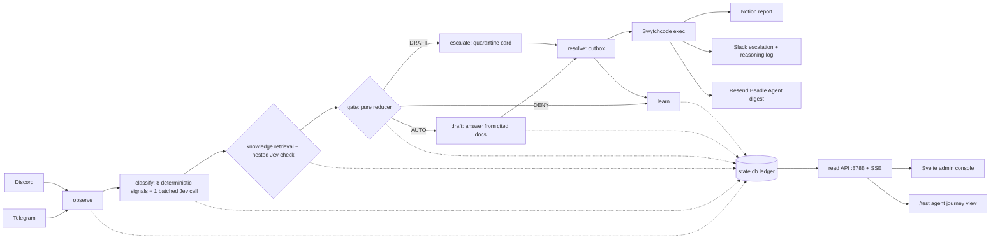

# Beadle — a calibrated community operator

**Track 3 (AI Community Agent) · Swytchcode buildathon · 26 September 2026**

Beadle moderates a community like a careful human operator: it watches every message, judges intent with **calibrated probabilities** instead of keyword lists, acts inside policy, escalates what it is unsure about to a human, and **learns from every admin override** — with a one-line reason recorded on every decision.

Built for Telegram and Discord communities, powered by one shared agent state machine, with **Swytchcode** as the execution boundary and **Notion** as the admin surface.

---

## What it does

- **Observe** every message through thin platform adapters (Telegram + Discord).
- **Classify** with deterministic signals (member age, first links, rate bursts, duplicate payloads, domain lists) plus Jev for semantic ambiguity (solicitation, question shape, impersonation, harmful-link intent).
- **Gate** with a pure reducer: hard vetoes quarantine; uncertainty asks a human; only clean, confident cases can auto-resolve.
- **Escalate** uncertain cases into a visible quarantine queue (Notion) with the reason and confidence attached.
- **Resolve** approved actions through the Swytchcode execution boundary (Discord post, Notion ledger write, Resend digest).
- **Learn** from human resolutions: every override becomes a labeled example; later, similar cases cite it — "because you taught me", never a black box.

The demo moment: a genuine question gets a confident answer while a polished scam hits the visible policy block — same second, opposite outcomes, judgment and confidence on screen.

## Architecture

Full diagram with planes, stores, and surfaces: [`docs/ARCHITECTURE.md`](docs/ARCHITECTURE.md).

Agent nodes:

| Node | Responsibility | Store |
| observe | Normalize platform events, stable event IDs, dedupe | `inbox_events`, `normalized_events` |
| classify | Deterministic signals + batched Jev semantic questions | `signal_runs` |
| gate | Pure reducer over signals + Jev probabilities → AUTO / DRAFT / DENY with reason + confidence | `decisions` |
| escalate | Quarantine card for human review | `action_intents` (outbox) |
| resolve | Outbox action intent → Swytchcode execution | `action_intents` |
| learn | Admin override → labeled example; replayable | `overrides`, `event_transitions` |




**State discipline:** LangGraph owns the event-scoped state; SQLite (`data/state.db`) is the durable ledger; `data/checkpoints.db` holds compact checkpoints (disposable, rebuildable). The thread id is `tenant:platform:event_id` — never one thread per community. Model calls never execute writes: every external action goes through the outbox.

### The gate

- **Rules first:** deterministic signals answer what structured data can answer; `UNKNOWN` is a first-class value, never assumed to be 0.
- **Jev second:** one batched call of parallel typed questions for ambiguous items only; answers stored with model/prompt versions; reused on replay.
- **Reducer:** dedupe → hard veto → scoped human override → rule evidence → Jev labels → action band. No naive averaging; each question keeps its own provenance.
- **Fail closed:** if the judgment API is unavailable, the gate routes to human review (`DRAFT`) — never fabricates a score.

## Stack

| Layer | Choice |
|---|---|
| Agent | Python 3.11 · LangGraph (`SqliteSaver`) |
| Judgment | Jev (typesafe.ai) — calibrated 0–1 probabilities for custom questions |
| Generation | Groq (`gpt-oss-20b` → `gpt-oss-120b`) → Gemini flash-lite fallback chain |
| Execution | Swytchcode (`swy`): Discord, Notion, Resend — verified actions only, dry-run first |
| Storage | SQLite (two files) + FTS5/sqlite-vec for memory |
| Admin surface | Notion (events ledger, quarantine queue, trust history) |
| Console | Svelte (reasoning stream, weekly report, policy history) |
| Platforms | Telegram (direct Bot API) · Discord (via Swytchcode) |

## Honesty

- The demo community is **staged; the writes are live.** Fixtures are modeled on documented real scam patterns — inputs are staged, outputs are never fabricated.
- Jev is a tiny paid meter; the policy block is Pro-tier or shown via `--dry-run` exit 4.
- Confidence is stored as a **gate score with its threshold** — we do not claim measured calibration beyond what was tested.
- Failures fail closed and stay visible; no silent fallbacks.

## Repository layout

```
app/            agent core: state, db, signals, Jev client, LangGraph machine, fixture runner
fixtures/       staged community inputs (MapleNest) + gate test cases
docs/           product brief, epic spine, stack, decisions, and research packs
requirements.txt
.env.example    every key the app reads (copy to .env; .env is never committed)
```

> This repository is the public subset of the project workspace: secrets, runtime data, and internal coordination notes are kept local via `.gitignore` and are never committed.

## Getting started

Quickstart (one block):

```bash
python3 -m venv .venv && source .venv/bin/activate
pip install -r requirements.txt
cp .env.example .env            # fill JEV_API_KEY, GROQ_API_KEY, bot/API keys
python3 -c "from app import db; db.init_state_db()"
scripts/knowledge seed          # seed the custom knowledge base
python3 -m app.main             # fixture smoke test (live Jev scores)
python3 -m uvicorn api.server:app --port 8788   # API + /test + /live views
pnpm --dir console install && pnpm --dir console run dev   # admin console
```

Step by step:

The smoke test pushes two staged messages (a genuine question and a polished scam) through the full state machine and prints the verdict, band, confidence, reason, and transition trail. With a live Jev key you get real scores; without one, the gate fails closed to human review by design.

## See it live

- **`demo.html`** — the product walkthrough (open in a browser): every stage, the prompt at each stage, the learning loop, the live chain, the data schema, and a time-flow simulation.
- **`http://localhost:8788/live`** — live agent view: metrics, prompts, event trails, and a mock chat that runs messages through the agent.
- **`http://localhost:5173/admin`** — admin console: counts, events, quarantine review, trace view.
- **`POST /api/ingest {"text": "..."}`** — inject a message into the running agent and watch it move.
- **`POST /api/quarantine/{event_id}/resolve`** — admin resolution → labeled example (learning loop writeback).

Run the stack:

```bash
python3 -m uvicorn api.server:app --port 8788   # read API + live view (needs .env)
pnpm --dir console run dev                      # admin console (SvelteKit)
python3 -m app.main                             # fixture smoke test
python3 -m app.swytchcode <event_id>            # live execution chain (Notion → Slack → Resend)
```

## Status (honest, as of 26 Sep 2026)

- **Working now:** agent core (6 states, 11 signals, one batched Jev classify call) with live scores; SQLite ledger + checkpoints; fail-closed gate; append-only transition trail + `scripts/trace`; mock-chat ingest; quarantine resolve writeback; **live 3-provider Swytchcode chain — Notion report → Slack escalation → Resend "Beadle Agent" digest** (`docs/chain-run-proof.json`); admin console + live agent view; product walkthrough (`demo.html`).
- **In progress:** memory store (FAQ / custom-knowledge retrieval), Telegram ingress, policy guardrails (3 rules in place with dry-run proofs — `docs/research-omp-policy-proofs.md`).
- **Blocked (documented, not faked):** Discord via Swytchcode (OAuth 401, Swytchcode-side); Telegram via Swytchcode (bundle URL-placeholder bug) → runs on the direct Bot API and is never counted as Swytchcode-mediated.
- **Not claimed:** calibration metrics, autonomous moderation at scale, or anything not present in this repo.

## Docs index

- `docs/T3-PROJECT.md` — locked project brief
- `docs/EPIC-SPINE.md` — epics, success metrics, build order
- `docs/TECH-STACK.md` — stack pins per stage
- `docs/DECISION-REGISTER.md` — every product/engineering decision with status
- `docs/BUILD-PLAN-TODAY.md` — the day's plan of attack
- `docs/DEPLOYMENT.md` — how to run everything + the deployment path and next steps
- `docs/TOPIC-SELECTION.md` — the process that chose this project (60 → 12 → 6 → 1)
- `docs/ARCHITECTURE.md` — standalone architecture diagram
- `docs/brainstorm/` — product and architecture threads
- `docs/research-*.md` — research packs (signals, memory, token budget, competition, gate wiring)

## Attribution

Built during the Swytchcode buildathon. Third-party services: Swytchcode (execution), Jev / typesafe.ai (judgment), Groq (generation), Notion (admin surface), Telegram + Discord (platforms), Resend (email).
