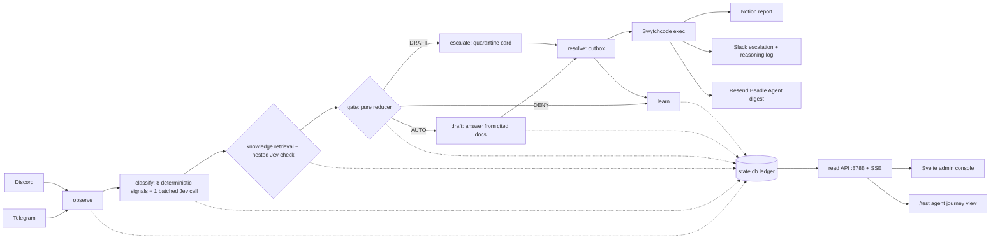

# Beadle — Architecture

Planes:
- **Agent plane** — LangGraph: observe → classify (signals + Jev) → knowledge check → gate → draft/escalate → resolve → learn. Every transition carries a one-line reason; every decision stores prompt version + hash, model, result status.
- **Data plane** — SQLite WAL: `state.db` (inbox, normalized events, signal runs, decisions, transitions, outbox, overrides, thresholds, token usage, audit, knowledge docs + FTS5) and `checkpoints.db` (LangGraph, disposable).
- **Execution plane** — outbox → `swy exec` verified methods only; live chain Notion → Slack → Resend; Telegram on the direct Bot API (documented bundle blocker).
- **Surfaces** — Notion (reports), Svelte console (admin), `/test` + `/live` (agent journey), Slack (reasoning log), demo.html (walkthrough).

Full flow + thresholds: `demo.html`, `docs/T3-PROJECT.md`, `docs/EPIC-SPINE.md`.
